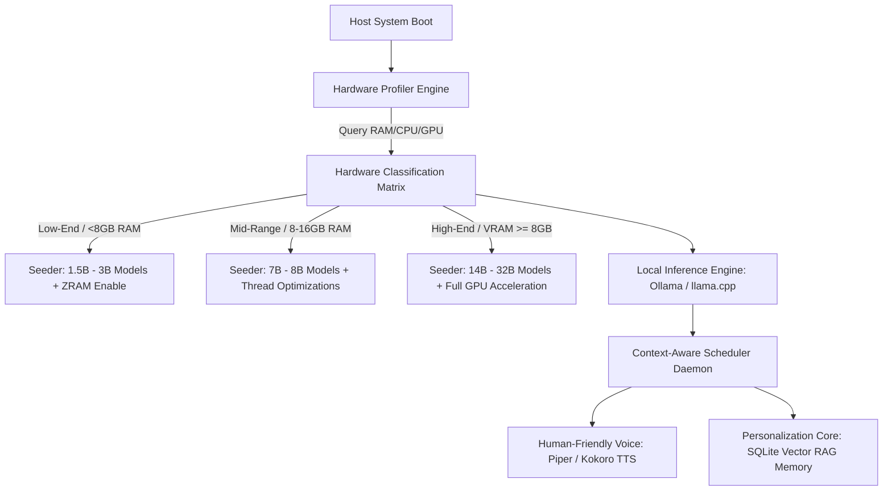

# M.A.T.R.I.X OS – Global AI-First Architecture Blueprint

This document details the architectural blueprint for scaling M.A.T.R.I.X OS from a static development environment into a globally applicable, self-configuring, local-first artificial intelligence operating system.

---

## 🌟 Executive Vision: The Self-Configuring AI-OS
Traditional operating systems partition resources based on static scheduling rules. M.A.T.R.I.X OS prioritizes **intent-driven automation**. The operating system dynamically evaluates its running hardware capabilities upon flashing/first boot, imports and optimizes the appropriate local models, synthesizes human-grade natural voice interactions, and continuously indexes user activity to construct a private, offline semantic memory.



---

## 🔌 Pillar I: Hardware-Aware Model Seeding Engine
To run globally on variable configurations—from low-spec legacy laptops to multi-GPU workstations—the system must audit its physical resources and apply right-sized model selections.

### Hardware Profiling & Classification Matrix
Upon installation, a hardware audit script queries:
*   **System RAM:** Dictates the maximum model size if running on CPU.
*   **GPU Vendor & VRAM:** Identifies if acceleration is available (CUDA, ROCm, metal) and how much VRAM is allocated.
*   **CPU Threads:** Determines optimal thread allocation for parallel execution.

Based on these parameters, the system categorizes the target machine:

| System Tier | Profile Requirements | Recommended LLM Models | System Optimizations |
| :--- | :--- | :--- | :--- |
| **Tier 1: Low-End** | RAM < 8GB<br>No discrete GPU | `qwen2.5:1.5b-instruct`<br>`llama3.2:1b` | ZRAM enabled with 150% compression<br>Ollama CPU thread cap = Cores - 1<br>`sysctl vm.swappiness=10` |
| **Tier 2: Mid-Range** | RAM 8GB - 16GB<br>No GPU or VRAM < 4GB | `qwen2.5:3b-instruct`<br>`llama3.2:3b` | Dynamic swap space allocation<br>Context window capped at 8K tokens |
| **Tier 3: High-End** | RAM 16GB - 32GB<br>GPU VRAM 4GB - 8GB | `llama3:8b-instruct`<br>`qwen2.5-coder:7b` | GPU Layer offloading enabled<br>Unified memory allocation for integrated GPUs |
| **Tier 4: Workstation** | RAM 32GB+<br>GPU VRAM >= 12GB | `qwen2.5:14b`<br>`llama3.3:70b-instruct` | 100% GPU offload<br>FlashAttention-2 activated |

---

## 🎙️ Pillar II: Human-Friendly Natural Voice Layer
 Robocentric synthetic voice engines (like standard `espeak`) make AI interactions feel cold and robotic. M.A.T.R.I.X OS replaces this with an offline, high-quality, neural text-to-speech synthesizer pipeline.

### Integration Pipeline
1.  **Engine Selection:** **Piper TTS** or **Kokoro TTS (82M parameters)**. Both run in real-time on CPU-only hardware (including laptops and Raspberry Pi).
2.  **Voice Modeling:** Pre-load natural, expressive voice models in `.onnx` formats (approx. 15-50 MB per voice model).
3.  **Real-Time Audio Buffer:**
    *   The Python core writes speech text to a pipe.
    *   Piper TTS consumes the text stream and outputs raw audio data (`PCM/WAV`).
    *   A simple Linux ALSA or PulseAudio player client streams the audio buffer to the speakers asynchronously to maintain low latency.

```
[System Agent Response] ➔ [Unix Named Pipe] ➔ [Piper Neural TTS Engine] ➔ [ALSA Audio Stream]
```

---

## 🧠 Pillar III: Local User Memory System (Vector RAG)
A personal OS must remember context across boots without sending data to the cloud.

### Local Semantic Memory Pipeline
*   **Vector DB Database:** Use **ChromaDB** or **SQLite-vss** (vector search extension) running locally.
*   **Background Indexing Daemon:** A lightweight service crawls:
    *   User file structures (noting document text and metadata).
    *   Executed shell history commands.
    *   Notes, bookmarks, and scheduled agent tasks.
*   **Context Retrieval:** When the user interacts with the system, the OS queries the local vector database, pulls the top $N$ relevant context snippets, and injects them directly into the local LLM context window.
*   **Privacy Guard:** All embeddings are computed locally using a tiny model (e.g. `all-minilm-l6-v2`, 45MB) running in Ollama.

---

## ⚡ Pillar IV: Automatic OS Performance Tuning
Low-spec devices must remain highly responsive. The OS dynamically configures:

1.  **ZRAM Memory Swap:** Compresses data in system RAM rather than writing to slow SSDs/HDDs. On 4GB/8GB systems, ZRAM doubles effective memory capacity.
2.  **Swappiness Configuration:** Sets `sysctl vm.swappiness=5` to prevent the OS from page-swapping active LLM parameters out of memory.
3.  **CPU Pinning:** Reserves 1 CPU core for the graphical interface, pinning the LLM background processing threads to the remaining cores to prevent screen lag.
